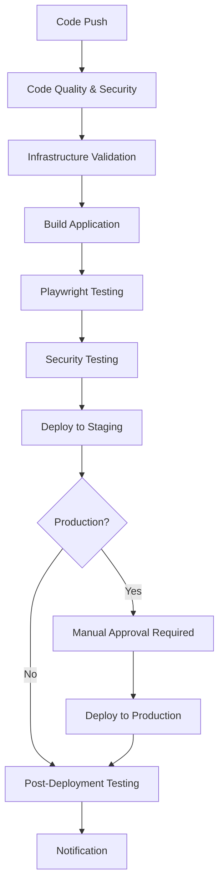

# 🚀 Deployment Guide - Sports Prediction System

This guide provides comprehensive instructions for deploying the Sports Prediction System using the automated CI/CD pipeline with GitHub Actions.

## 📋 Prerequisites

### Required Accounts & Access
- Azure subscription with sufficient permissions
- GitHub repository with Actions enabled
- Azure CLI installed locally (for initial setup)
- Terraform CLI installed locally (for validation)

### Required Teams (CODEOWNERS)
Ensure these teams are created in your GitHub organization:
- `@devops-team` - Infrastructure and deployment approval
- `@backend-team` - Application code approval
- `@qa-team` - Testing changes approval
- `@security-team` - Security-related changes approval
- `@docs-team` - Documentation changes approval

## 🔧 Initial Setup

### 1. Azure Service Principal Setup

Create service principals for each environment:

```bash
# Login to Azure
az login

# Create service principal for staging
az ad sp create-for-rbac --name "sp-sports-prediction-staging" \
  --role "Contributor" \
  --scopes "/subscriptions/YOUR_SUBSCRIPTION_ID" \
  --sdk-auth

# Create service principal for production
az ad sp create-for-rbac --name "sp-sports-prediction-production" \
  --role "Contributor" \
  --scopes "/subscriptions/YOUR_SUBSCRIPTION_ID" \
  --sdk-auth
```

### 2. GitHub Repository Secrets

Configure the following secrets in your GitHub repository (`Settings > Secrets and variables > Actions`):

#### Azure Authentication
```
AZURE_CLIENT_ID=<your-client-id>
AZURE_CLIENT_SECRET=<your-client-secret>
AZURE_SUBSCRIPTION_ID=<your-subscription-id>
AZURE_TENANT_ID=<your-tenant-id>

# Environment-specific
AZURE_CLIENT_ID_STAGING=<staging-client-id>
AZURE_CLIENT_SECRET_STAGING=<staging-client-secret>
AZURE_CLIENT_ID_PRODUCTION=<production-client-id>
AZURE_CLIENT_SECRET_PRODUCTION=<production-client-secret>
```

#### Application URLs (will be set after first deployment)
```
FUNCTION_APP_URL_STAGING=https://sports-prediction-staging.azurewebsites.net
FUNCTION_APP_URL_PRODUCTION=https://sports-prediction-prod.azurewebsites.net
```

#### Optional Notifications
```
SLACK_WEBHOOK_URL=<your-slack-webhook-url>
```

### 3. GitHub Environment Setup

Configure environments in GitHub (`Settings > Environments`):

#### Staging Environment
- **Name**: `staging`
- **Deployment branches**: Custom branches (develop, main)
- **Required reviewers**: `devops-team`
- **Wait timer**: 5 minutes

#### Production Environment
- **Name**: `production`
- **Deployment branches**: Protected branches only (main)
- **Required reviewers**: `devops-team`, `security-team`
- **Wait timer**: 30 minutes

### 4. Branch Protection Rules

Configure branch protection for `main` branch:
- Require pull request reviews (2 reviewers)
- Require status checks to pass
- Require CODEOWNERS review
- Dismiss stale reviews
- Restrict pushes to specific teams

## 🏗️ Deployment Process

### Automatic Deployments

The CI/CD pipeline automatically triggers on:

1. **Push to `develop`**: Deploys to staging environment
2. **Push to `main`**: Deploys to staging, then production (with approval)
3. **Pull Request**: Runs all tests and validations

### Manual Deployment

For manual deployments, use the workflow dispatch:

1. Go to `Actions > CI/CD Pipeline`
2. Click "Run workflow"
3. Select target environment
4. Optionally skip tests (not recommended)

### Deployment Flow



## 🧪 Testing Strategy

### Automated Testing Layers

1. **Unit Tests**: Python pytest for individual functions
2. **Integration Tests**: Playwright tests for API endpoints
3. **End-to-End Tests**: Full workflow testing with Playwright
4. **Security Tests**: Vulnerability scanning and security validation
5. **Performance Tests**: Load testing with configurable parameters

### Test Execution

Tests run automatically on every:
- Pull request
- Push to main/develop branches
- Before deployments

Skip tests only in emergency situations using workflow dispatch.

## 🔒 Security & Compliance

### Security Scanning

Automated security scanning includes:
- **Python Dependencies**: Safety check for known vulnerabilities
- **Code Security**: Bandit static analysis
- **Infrastructure**: Checkov and TFSec for Terraform
- **Secrets**: TruffleHog for exposed secrets
- **Container Security**: Trivy scanning (if using containers)

### Compliance Checks

The pipeline enforces:
- CODEOWNERS approval requirements
- Security scan passing
- All tests passing
- Infrastructure validation
- Deployment approvals

### Security Incident Response

For security issues:
1. Create security advisory (private)
2. Fix in private fork
3. Deploy emergency patch
4. Publish security advisory

## 🚨 Emergency Procedures

### Emergency Rollback

For critical issues in production:

1. Go to `Actions > Emergency Rollback`
2. Select environment (staging/production)
3. Provide rollback reason
4. Optionally specify target version
5. Execute with required approvals

### Hotfix Process

For urgent fixes:

1. Create hotfix branch from `main`
2. Make minimal changes
3. Create PR with `priority: critical` label
4. Fast-track review process
5. Deploy to staging, then production

### Incident Response

1. **Detect**: Monitoring alerts or user reports
2. **Assess**: Determine severity and impact
3. **Respond**: Use rollback or hotfix as appropriate
4. **Communicate**: Update status page and stakeholders
5. **Resolve**: Fix root cause
6. **Review**: Post-incident review and improvements

## 📊 Monitoring & Observability

### Application Monitoring

Monitor using Azure Application Insights:
- Function execution metrics
- Error rates and exceptions
- Performance metrics
- Custom telemetry

### Infrastructure Monitoring

Monitor Azure resources:
- Function App health and performance
- Cosmos DB metrics and costs
- Resource utilization
- Security alerts

### Deployment Monitoring

Track deployment success:
- Pipeline execution times
- Test pass rates
- Deployment frequency
- Mean time to recovery (MTTR)

## 🔧 Troubleshooting

### Common Issues

#### Deployment Failures
```bash
# Check Azure CLI authentication
az account show

# Validate Terraform configuration
cd infra
terraform init
terraform validate
terraform plan
```

#### Test Failures
```bash
# Run tests locally
npm test --prefix tests

# Run specific test category
npx playwright test e2e/api-tests.spec.js --project=chromium
```

#### Authentication Issues
- Verify service principal permissions
- Check secret expiration dates
- Validate environment configurations

### Debug Mode

Enable debug logging by setting:
```yaml
env:
  ACTIONS_STEP_DEBUG: true
  ACTIONS_RUNNER_DEBUG: true
```

## 📈 Performance Optimization

### Deployment Speed
- Parallel test execution
- Cached dependencies
- Optimized Docker builds
- Incremental deployments

### Cost Optimization
- Use appropriate SKUs for environments
- Implement auto-scaling
- Monitor resource usage
- Regular cost reviews

## 🔄 Maintenance

### Regular Tasks

#### Weekly
- Review security scan results
- Check dependency updates
- Monitor deployment metrics
- Review failed tests

#### Monthly
- Update dependencies
- Review and update documentation
- Analyze performance metrics
- Security compliance review

#### Quarterly
- Review and update CI/CD pipeline
- Infrastructure cost optimization
- Disaster recovery testing
- Security assessment

### Updates and Upgrades

#### Dependency Updates
1. Update requirements.txt and package.json
2. Run security scans
3. Execute full test suite
4. Deploy to staging for validation

#### Infrastructure Updates
1. Update Terraform configurations
2. Plan and review changes
3. Deploy to staging first
4. Validate functionality
5. Deploy to production with approval

## 📞 Support & Escalation

### Support Contacts
- **DevOps Team**: devops-team@company.com
- **Security Team**: security-team@company.com
- **On-Call Engineering**: oncall@company.com

### Escalation Matrix
1. **Level 1**: Development team member
2. **Level 2**: Senior developer or team lead
3. **Level 3**: DevOps team
4. **Level 4**: Security team / Management

### Communication Channels
- **Slack**: #deployments, #security-alerts
- **Email**: team-distribution-lists
- **Incident Management**: PagerDuty/Opsgenie

---

## 📚 Additional Resources

- [Azure Functions Documentation](https://docs.microsoft.com/en-us/azure/azure-functions/)
- [Terraform Azure Provider](https://registry.terraform.io/providers/hashicorp/azurerm/latest/docs)
- [Playwright Testing Guide](https://playwright.dev/docs/intro)
- [GitHub Actions Documentation](https://docs.github.com/en/actions)
- [Azure DevOps Best Practices](https://docs.microsoft.com/en-us/azure/devops/learn/)

For questions or issues not covered in this guide, please create an issue using the provided templates or contact the DevOps team.
